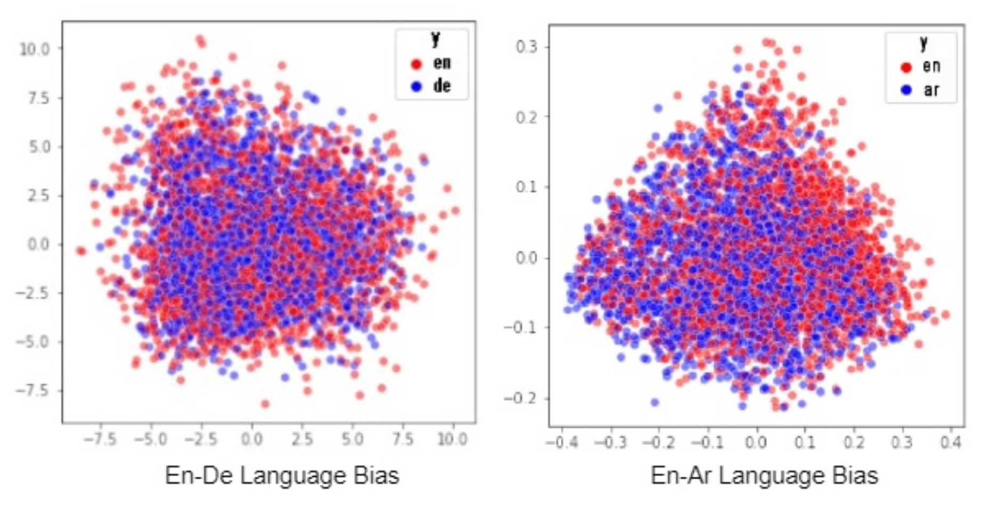

# Enhancing Multilingual Information Retrieval with Reranking using Mono-Language Sentence Embeddings and Knowledge Distillation

In this project, a multilingual reranking pipeline is being developed using Mono-language sentence embeddings and knowledge distillation. The first step involves creating models for cross language sentence embeddings using knowledge distillation techniques. Then this sentence embedding models are used to create the Multilingual Biencoder structures which in turn as used for reranking.

## Methodology

1. `Sentence Comparison`: The pipeline aims to compare sentences in multiple languages (English, German, Arabic) with a query sentence in English. This involves using a biencoder approach, which utilizes different types of biencoders (En-En, En-De, En-Ar) to compare sentences within their respective language pairs.
2. `Biencoder Approach`: The biencoder approach involves employing separate biencoders for each language pair (e.g., English-English, English-German, English-Arabic). These biencoders are used to encode sentences and generate embeddings. The embeddings are then used to compute similarity scores between sentences, enabling sentence comparison across languages.
3. `Knowledge Distillation and Mean Pooling`: To ensure that the scores generated by the embedding generating BERT models are comparable, the models are trained using knowledge distillation. This process involves transferring knowledge from a teacher model to a student model. Additionally, mean pooling is employed as a method to aggregate the embeddings and produce a single representation for each sentence pair. This facilitates a standardized approach for comparing sentences across different language pairs.

</img> </img>

## Evaluation Metrics

1. ***MSE Evaluation***: Measured the mean squared error (MSE) between the student embeddings and teacher embeddings.
2. ***Translation Accuracy***: measure the translation accuracy. Given a list with source sentences, for example, 1000 English sen- tences. And a list with matching target (translated) sen- tences, for example, 1000 German sentences. For each sentence pair, we check if their embeddings are the closest using cosine similarity.
3. ***Multi-Lingual Semantic Textual Similarity***: Measured the semantic textual similarity (STS) between sentence pairs in different languages where sentences1 and sentences2 are lists of sentences and the score is a numeric value indicating the semantic similarity between sentences1 item and sentences2 item.
4. ***Language Bias***: Language bias is a phenomenon where a model shows a preference for a particular language or language pair over others.

    </img>

---
## Datasets Used

1. TED2020
2. STS

## Models Used

1. `Teacher Model`: We use an English SBERT model as teacher model M. Model Trained fully from scratch with evaluation done on TED2020 dataset.

2. `Student Model`: XLM RoBERTa (XLM-R)

### ***Contributors***

-   Jaimin Gajjar
-   Saurabh Modi
-   Mukul Shingwani
